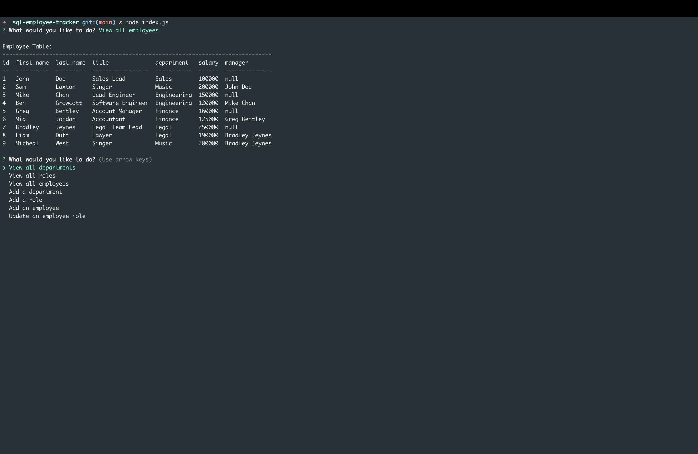

# SQL Employee Tracker

## Description

This web application is a SQL employee tracker, this is used to keep track of employees within a database. I have used the inquirer package which has allowed me to use questions as prompts, I have then used the answers to the questions to send the information into a database which then can be used to showcase current employees, salaries, roles and manager. The database is called employeetracker_db.

This project was build to demonstrate my ability of using node.js, mysql2, and console.table. Using all of these together has allowed me to explore different avenues within the backend.

## Mock Up

## Google Drive Application Walk Through Link
https://drive.google.com/file/d/1uOl2kyTLF7tp4V74GB1ciL8MShe4I6gd/view?usp=sharing